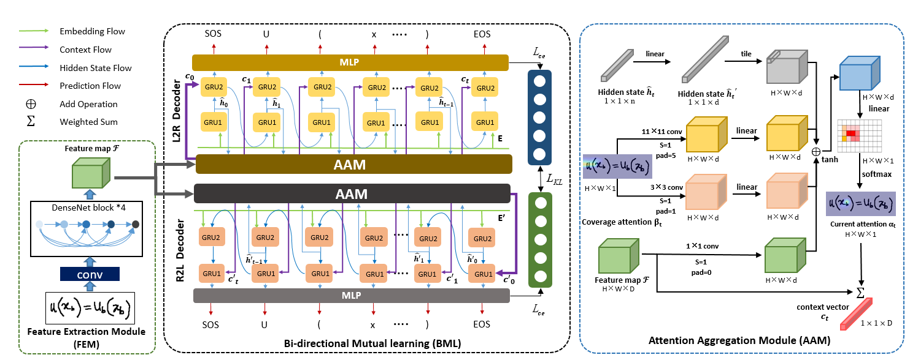
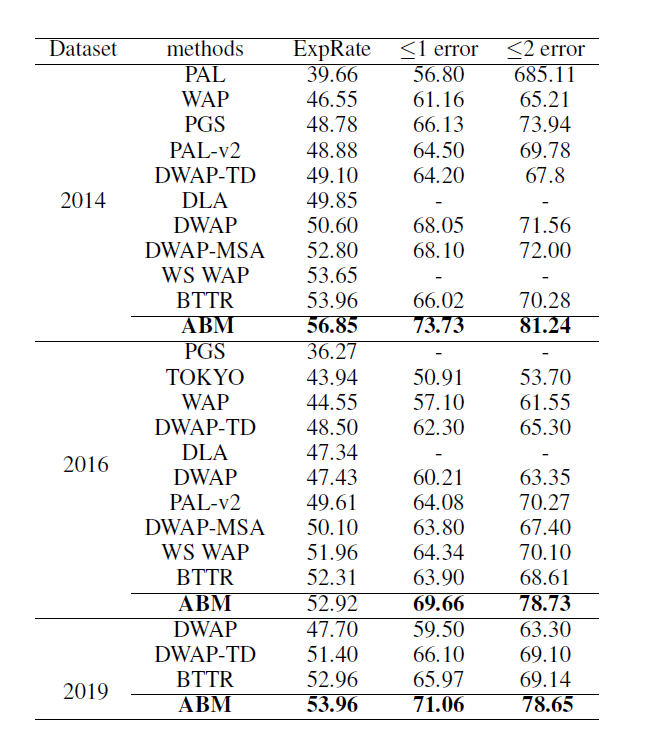
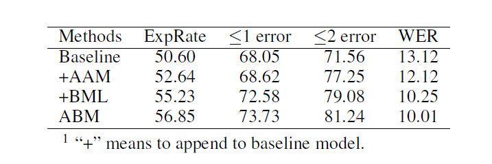
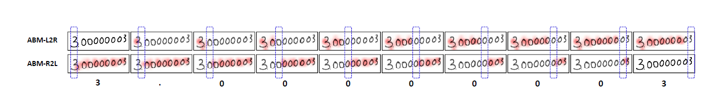
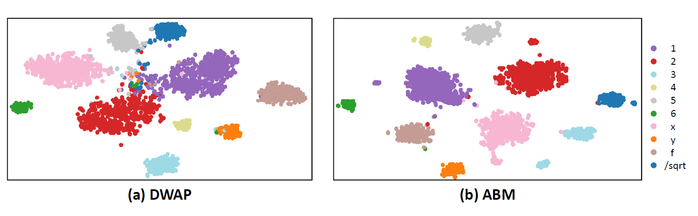

# Handwritten Mathematical Expression Recognition via Attention Aggregation based Bi-directional Mutual Learning (AAAI 2022 Oral)


This is the origin Pytorch implementation of ABM. 

## Methods

We propose a novel framework with **A**ttention aggregation and **B**i-directional **M**utual learning **(ABM)** for HMER. Specially, our framework includes three modules: Feature Extraction, Attention Aggregation and Bi-directional Mutual Learning.
(1) In Feature Extraction module, we use DenseNet as feature extractor as it has proved to be effective in WAP. 
(2) In Attention Aggregation module, we propose multi-scale coverage attention to recognize characters of different sizes in mathematical expressions, thereby improving the recognition accuracy at the current moment and alleviating the problem of error accumulation.
(3) In Bi-directional Mutual Learning module, we propose a novel decoder framework with two parallel decoder branches in opposite decoding directions (L2R and R2L) and use mutual distillation to learn from each other. Specifically, this framework helps the current coverage attention to capitalize upon historical and future information sufficiently at the same time, so as to better determine the current attention position. Therefore, each branch can learn more complementary context information and explore long-distance dependency information through step-by-step mutual learning, leading to stronger decoding ability. Note that while we use two decoders for training, we only use one L2R branch for inference.


</p>
<p align="center">

<br><br>
<b>Figure 1.</b> The attention of L2R branch of ABM (left:coverge attention, right: current attention).
</p>

</p>
<p align="center">

<br><br>
<b>Figure 2.</b> The attention of R2L branch of ABM (left:coverge attention, right: current attention).
</p>


</p>
<p align="center">

<br><br>
<b>Figure 3.</b> The architecture of ABM.
</p>


## Requirements

- Python 3.6
- numpy == 1.19.4
- torch == 1.6.0


## Data
We use the Offline Handwritten Formula Recognition dataset CROHME 2014, 2016 and 2019 that can be download in the [TC-11 Online Resources](http://tc11.cvc.uab.es/datasets/ICDAR2019-CROHME-TDF_1) or in offical [ICDAR 2019 CROHME + TFD Competition ](https://www.cs.rit.edu/~crohme2019/dataANDtools.html).
The required data files should be put into `data/` folder. A demo slice of the data is illustrated in the following figure. 


## Usage


Note that we train our model on one train set CROHME 2014 and test the model on three test sets CROHME 2014, CROHME 2016, and CROHME2019. Commands for training and testing the model with single decoder branch or two decoder branches respectively are as follows:

```bash
# for training on CROHME 2014  with one L2R branch (baseline model)
sh train.sh -L2R

# for training on CROHME 2014  with two branches (L2R and R2L) (our model, ABM)
sh train.sh -L2R-R2L


# for testing on CROHME 2014, 2016, 2019 with L2R branch
sh test.sh -2014  L2R


# for testing on CROHME 2014, 2016, 2019 with R2L branch
sh test.sh -2014  R2L

```

# 


The detailed descriptions about the arguments are as following:

| Parameter name | Description of parameter |
| --- | --- |
| dictionaries           |        dictionaries for 113 class symbols      (defaults to `./data/dictionary_bid.txt`)                                |
| train_datasets      | The root path of the data file (defaults to `./data/offline-train.pkl`)  and label file  (defaults to `./data/train_caption.txt`)  |
| valid_datasets      | The root path of the data file (defaults to `./data/offline-test.pkl`)  and label file  (defaults to `./data/test_caption..txt`)  |
| valid_output       | The path to store the decoding LaTeX result of each epoch|
| saveto         | The path to store the model of each epoch          |
| n           | GRU1 dimension  (defaults to 256)   |
| m    |  GRU2 dimension  (defaults to 256)  |
| dim_attention | attention dimension (defaults to 512)  |
| D | The channel of feature map generated encoder (DenseNet)  (defaults to 628)  |
| growthRate | The growthrate of DenseNet (defaults to 24) |
| reduction | The reduction of DenseNet (defaults to 0.5)|
| bottleneck | The bottleneck of DenseNet (defaults to True) |
| use_dropout | The use_dropout of DenseNet (defaults to True) |
| input_channels | The input_channels of DenseNet (defaults to 1) |
| batch_Imagesize | The max batch_Imagesize for training (defaults to 320000)|
| maxImagesize | The max batch_Imagesize for training(defaults to 320000) |
| valid_batch_Imagesize | The max batch_Imagesize for testing (defaults to 320000) |
| batch_size | The batch size of training input data (defaults to 16) |
| valid_batch_size | The batch size of testing input data (defaults to 16) |
| batch_Imagesize | The max batch_Imagesize for training (defaults to 320000)|
| maxlen | The max length for one sample (defaults to 200) |
| max_epochs | The max train epochs (defaults to 5000) |
| dispFreq | The batch size of testing input data (defaults to 100) |
| patience | The patience of changing learning rate  (defaults to 15) |
| learning_rate | The learning rate of optimizer  (defaults to 1) |
| lr_decrease_rate | The decline rate of learning rate (defaults to 2) |
| halfLrFlag_set | The flag of early stop (defaults to 10) |
| finish_after | The max iteration of early stop (defaults to 10000000) |
| my_eps | The eps of optimizer (defaults to 1e-6) |
| decay_c | The weight_decay of optimizer (defaults to 1e-4) |
| clip_c | clip_grad_norm (defaults to 100.) |
| patience | changing learning rate patience (defaults to 3) |
| device_ids | Device ids of gpu (defaults to `0`) |


## <span id="resultslink">Results</span>


Besides, the experiment parameters of each data set are formated in the `.sh` files. You can refer to these parameters for experiments, and you can also adjust the parameters to obtain better results or draw better prediction figures.

<p align="center">

<br><br>
<b>Figure 4.</b> Comparison with prior works (in %). Note that our results are from L2R branch. The results shown in the upper are partly cited from their corresponding papers.
</p>


<p align="center">

<br><br>
<b>Figure 5.</b> Ablation study (in %). We evaluate AAM and BML modules on CROHME 2014 test dataset.
</p>


<p align="center">

<br><br>
<b>Figure 6.</b> Coverage attention visualization process of translating handwritten mathematical expressions into LaTeX sequencesin two directions (L2R and R2L). The blue box indicates the character being decoded in current time step.
</p>


<p align="center">

<br><br>
<b>Figure 7.</b> t-SNE Visualisation of DWAP (baseline) and ABM
on CROHME 2014.
</p>

